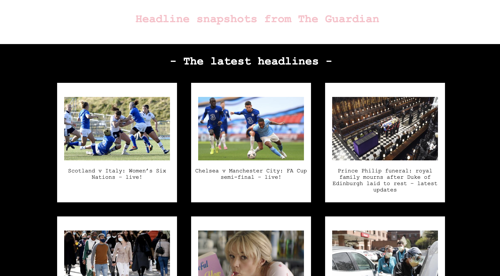

#### Week 7 learning goals:

- Build a frontend single-page app using only pure Javascript.
- Request and use data from an external API.
- Explain that libraries are made of ordinary code that I could write myself if I needed to.

#### Challenges

| challenge                            | Evidence                                            |
| -------------------------------------|-----------------------------------------------------|
| Team Challenge: Notes app            |  https://github.com/dmgreaves/notes-app             |
| Weekend challenge: News Summary      |  https://github.com/loushark/news-summary-challenge |

----

### News Summary

 
