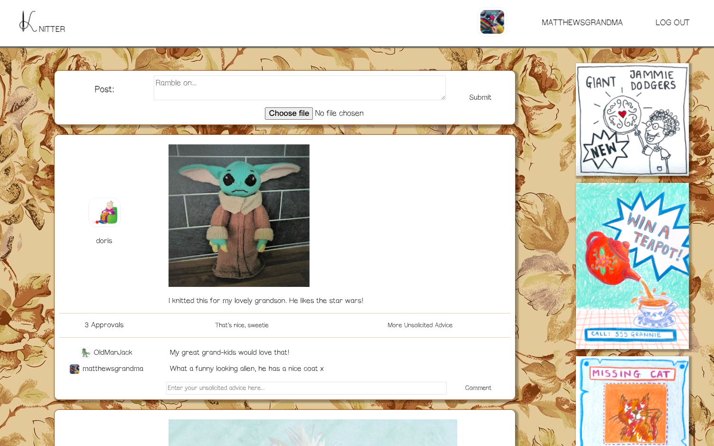

#### Week 8 & 9 learning goals:

- Working as a team
- Using a new framework: Ruby on rails

#### Challenges

| challenge                                   | evidence                                         |
| --------------------------------------------|--------------------------------------------------|
| Team Challenge: Acebook (Knitter)           |  https://github.com/loushark/knitter-acebook     |
| Weekend challenge: Instagram                |  https://github.com/loushark/instagram-challenge |

----

### Knitter

- Frontend Rendering and Backend - Ruby on Rails using Postgresql
- Frontend styling and interaction - HTML, CSS and Javascript (for ajax partial rendering)
- Testing: RSPEC (with gems for rails)
- Linting: Rubocop (with gems for rails and rspec)
- Bcrypt for password hashing
